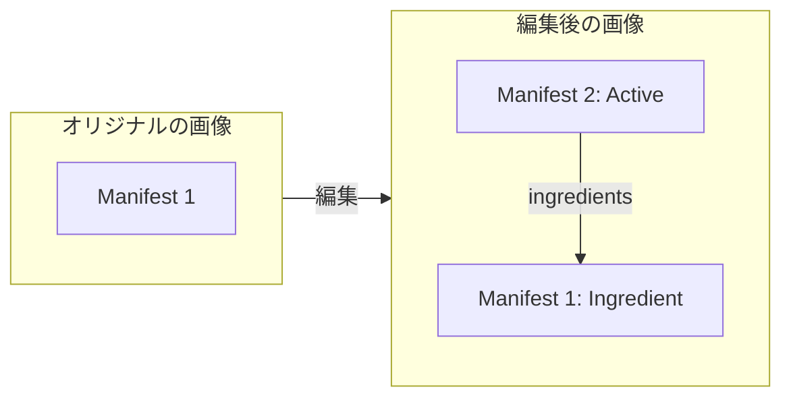
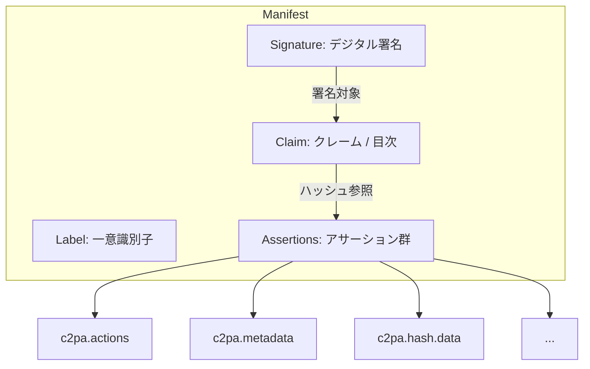
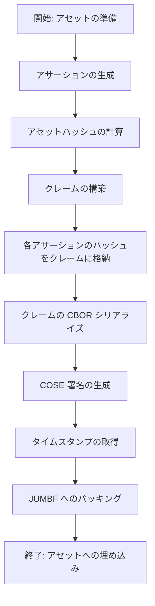
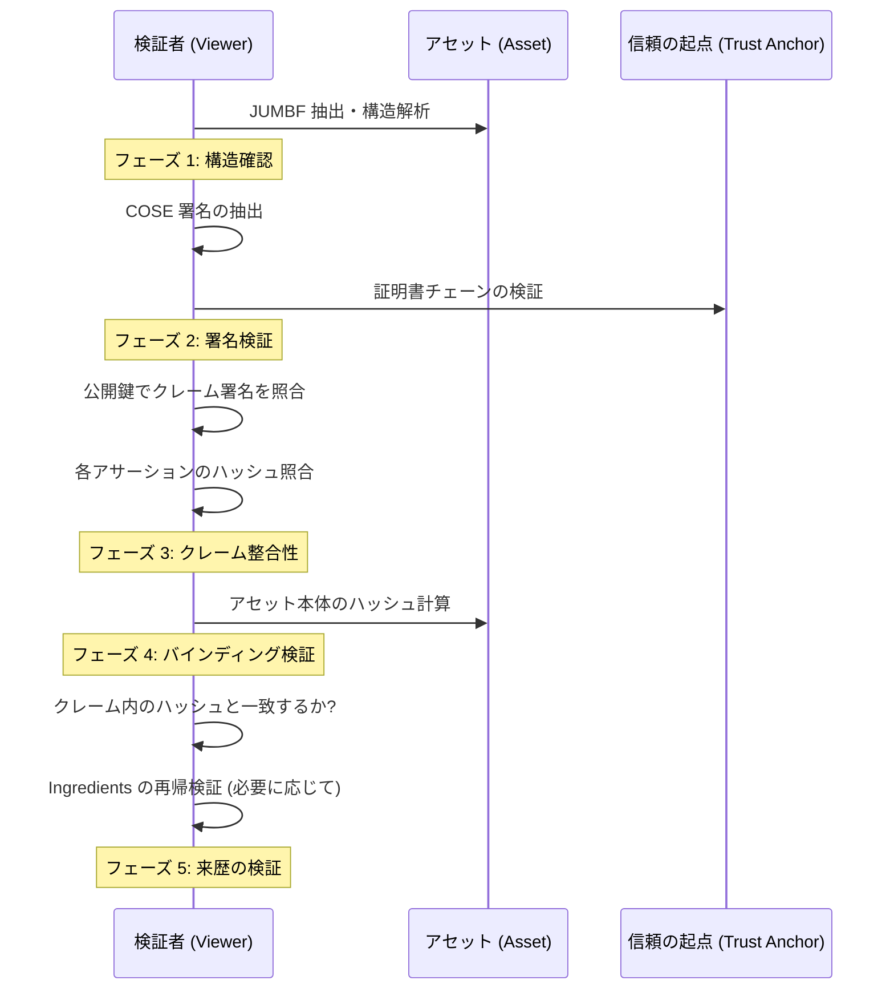
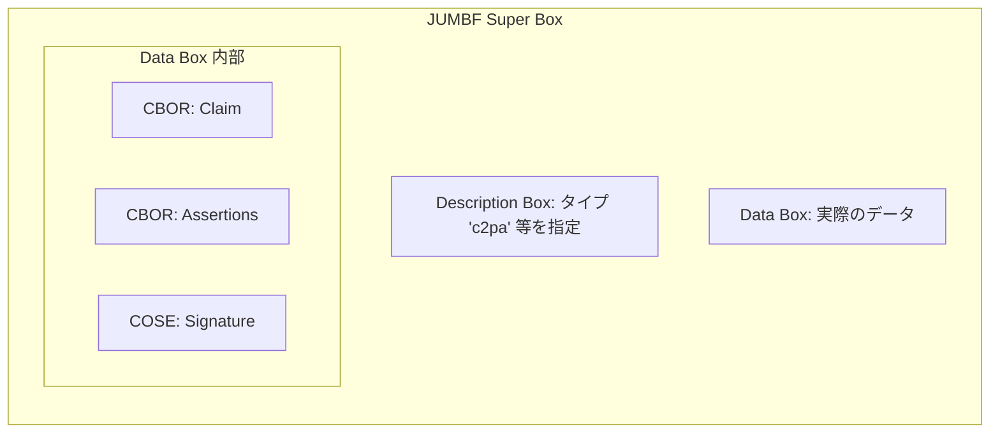

# C2PA 仕様詳説 (C2PA Technical Specification v2.2)

本資料は、[C2PA Specification v2.2](https://spec.c2pa.org/specifications/specifications/2.2/specs/C2PA_Specification.html) の内容を網羅的に網羅し、日本語で詳細に解説した技術ドキュメントです。

---

## 1. 導入 (Introduction)

C2PA (Coalition for Content Provenance and Authenticity) は、デジタルメディアの信頼性を確立するためのエンドツーエンドのフレームワークを提供します。

### 1.1 目的
コンテンツの来歴（Provenance）を証明し、作成者、編集履歴、および情報の正当性を検証可能にすることで、情報の透明性を高め、誤情報やディープフェイクへの対策とすることを目的としています。

### 1.2 設計目標
- **暗号学的な紐付け**: コンテンツと来歴情報を不可分に結合。
- **改ざん検知**: 署名後に情報が変更された場合、即座に検知可能。
- **相互運用性**: プラットフォームやファイル形式を問わず動作。
- **プライバシー**: 必要最小限の公開と、特定の情報の秘匿をサポート。

---

## 2. 原則と考慮事項 (Principles and Considerations)

### 2.1 セキュリティ原則
- **信頼の起点 (Trust Anchors)**: 署名者の身元は、信頼された認証局 (CA) によって保証される必要があります。
- **タイムスタンプ**: 署名の時刻を証明し、証明書の失効後も検証を可能にします。
- **暗号の現代性**: 推奨される暗号アルゴリズム（Ed25519, ES256 等）の使用。

### 2.2 プライバシー原則
- **最小限の開示**: コンテンツに関連付けられる個人情報は必要最小限に抑えるべきです。
- **秘匿化 (Redaction)**: 来歴の連鎖を壊さずに、特定のアサーションを削除できる仕組み。

### 2.3 ユーザー体験 (UX) の考慮事項
- **L3 (Levels of Assurance)**: ユーザーが情報の信頼度を直感的に理解できるインターフェースの提供。
- **一貫性**: 異なるビューアでも同じ情報が同じように表示されること。

---

## 3. アーキテクチャ概要 (Architecture Overview)

C2PA アーキテクチャは、論理的なデータ構造と、それを物理的なメディアファイルに埋め込む方法の二層で構成されます。

### 3.1 構成要素
- **Asset (アセット)**: 画像、動画、音声などのメディアファイル本体。
- **Manifest (マニフェスト)**: アセットに関する情報の集合。
- **Manifest Store (マニフェスト・ストア)**: 複数のマニフェスト（履歴）を格納するコンテナ。

---

## 4. マニフェスト・ストアの構造 (Manifest Store Structure)

マニフェスト・ストアは、ファイル内に含まれるすべての C2PA データのルートです。

### 4.1 論理構造
1.  **Active Manifest**: 現在のアセットに対応する最新のマニフェスト。
2.  **Ingredient Manifests**: 過去の編集段階で付与されたマニフェストのコピー。

#### 来歴の連鎖 (Chain of Trust) のイメージ

### 4.2 マニフェストの内部
マニフェストは、以下のコンポーネントで構成されます。

- **Label**: マニフェストを一意に識別する文字列。
- **Claim (クレーム)**: マニフェストの目次および署名対象。
- **Assertions (アサーション)**: 実際のデータ（操作履歴、作成者など）。
- **Signature (署名)**: クレームに対するデジタル署名。

---

## 5. クレーム (Claim) の詳細

クレームはマニフェストの中核となる辞書データで、CBOR 形式でシリアライズされます。

### 5.1 クレームに含まれる主要フィールド
- `claim_generator`: マニフェストを作成したツールの識別子。
- `claim_generator_info`: 生成ツールの詳細（名前、バージョン、アイコン等）。
- `signature`: 署名データへのポインタ。
- `assertions`: 各アサーションへのハッシュリンクのリスト。
- `alg`: ハッシュ計算に使用したアルゴリズム（SHA-256 など）。

---

## 6. アサーション (Assertions)

アサーションは、コンテンツに関する特定の事実を表明する最小単位です。

### 6.1 標準アサーション・スキーマ
| ラベル | 内容 |
| :--- | :--- |
| `c2pa.actions` | コンテンツに加えられた編集、変換操作のリスト。 |
| `c2pa.metadata` | 名前、タイトル、著作権などの標準メタデータ（XMP互換）。 |
| `c2pa.ingredients` | 現在のアセットを作成するために使用された素材（親アセット）の参照。 |
| `c2pa.thumbnail` | アセットまたはマニフェストに関連付けられたプレビュー画像。 |
| `cawg.training-mining` | AI 学習やデータマイニングに関する利用制限の意思表示。 |
| `c2pa.hash.data` | アセット本体のハッシュ値（コンテンツ・バインディング用）。 |

### 6.2 アクション (c2pa.actions) の詳細
各アクションエントリには以下を含めることができます：
- `action`: `c2pa.created`, `c2pa.edited`, `c2pa.filtered`, `c2pa.resized`, `c2pa.placed` など。
- `parameters`: 操作の詳細（例：フィルタ名）。
- `softwareAgent`: 操作を行ったソフトウェア。
- `digitalSourceType`: 生成AIの使用の有無を示す重要なプロパティ。

---

## 7. コンテンツ・バインディング (Content Binding)

アセット本体とマニフェストを暗号学的に結びつけるプロセスです。

### 7.1 ハッシュ計算の対象
- **Data Hash**: ファイルのバイナリデータ（C2PA 格納領域を除く）のハッシュ。
- **Exclusion Map**: ハッシュ計算から除外する領域（JUMBF ボックス自体など）を指定するマップ。

### 7.2 ボックス・バインディング
動画ファイルなど、ストリーミングが必要な形式では、個別のデータボックス（moov, mdat 等）ごとにハッシュを計算し、バインディングを強化します。

---

## 8. 署名 (Signatures)

C2PA は **COSE (CBOR Object Signing and Encryption)** 規格（RFC 9052）を使用します。

### 8.1 署名構造
- **Protected Header**: 暗号アルゴリズム（ES256, Ed25519 等）や証明書識別子。
- **Payload**: クレームの CBOR バイナリ。
- **Signature Value**: 生成されたデジタル署名。
- **Unprotected Header**: X.509 証明書チェーン、RFC 3161 タイムスタンプ、OCSP レスポンス。

### 8.2 署名生成プロセス
署名は以下のステップで生成されます。

#### 技術的詳細：
1.  **アサーション生成**: 編集履歴 (`actions`) や素材情報 (`ingredients`) を CBOR 形式で作成します。
2.  **アセットハッシュ計算**: アセットのバイナリデータから、C2PA データ格納領域（予定地）を除外した領域のハッシュを計算します。
3.  **クレーム構築**: 生成ツール情報、アセットハッシュ、各アサーションへのポインタ（ラベルとハッシュ値）をまとめます。
4.  **COSE 署名**: シリアライズされたクレームをペイロードとして署名を行います。秘密鍵は署名者（作成者や組織）の管理下にあります。
5.  **タイムスタンプ**: 署名値を外部の TSA に送信し、署名時刻を証明する署名付きトークンを取得して COSE 構造の `unprotected header` に格納します。

---

## 9. 検証プロセス (Validation Process)

検証者は、以下のフローに従ってマニフェストの正当性を確認します。

### 9.1 フェーズ 1: 構造解析
JUMBF 構造が正しく、マニフェスト・ストアが抽出可能であることを確認します。

### 9.2 フェーズ 2: 署名の検証
1.  **COSE 解析**: 署名構造をデコードし、アルゴリズムとパラメータを取得します。
2.  **証明書検証**: 署名に使用された証明書が、OSやブラウザが信頼するルート認証局まで辿れるか（Chain of Trust）を確認します。
3.  **失効確認**: OCSP や CRL を使用して、証明書が失効していないか確認します。
4.  **タイムスタンプ検証**: TSA の署名を検証し、署名が証明書の有効期間内に行われたことを確認します。
5.  **暗号学的検証**: 公開鍵を用いて、シリアライズされたクレームのハッシュが署名値と一致することを確認します。

### 9.3 フェーズ 3: クレームの整合性検証
クレーム内の `assertions` リストに含まれる各アサーションのハッシュ値を計算し、クレームに記録されている値と比較します。これにより、個別のメタデータが書き換えられていないことが保証されます。

### 9.4 フェーズ 4: アセット・バインディングの検証
アセット本体（画像データ等）のバイナリからハッシュを再計算します。この際、マニフェスト内に記録されている `Exclusion Map` を使用して、C2PA データ自体などの「署名対象外領域」を正確にスキップする必要があります。再計算したハッシュがクレーム内の `c2pa.hash.data` と一致すれば、マニフェストと画像が正しく紐付いていると言えます。

### 9.5 フェーズ 5: 来歴の検証 (Chain of Trust)
現在のアセットが他のアセット（素材）から生成された場合、`ingredients` アサーションに含まれる親マニフェストに対しても同様の検証を再帰的に行います。これにより、最初から最後まで信頼が途切れていないことを確認します。

---

## 10. 物理的格納 (JUMBF カプセル化)

C2PA は **ISO/IEC 19566-5 (JUMBF)** を利用してデータを格納します。JUMBF はバイナリデータを「ボックス」という単位で階層的に保持する形式です。

### 10.1 JUMBF の基本構造

- **Description Box**: データのタイプ（`c2pa`）やラベルを指定します。
- **Data Box**: 実際のペイロード（CBOR, 署名, サムネイル等）を格納します。

### 10.2 ファイル形式別詳細
アセットの形式に応じて、JUMBF を埋め込む場所が規定されています。

| 形式 | 格納場所 | 詳細 |
| :--- | :--- | :--- |
| **JPEG** | `APP11` マーカー | 0xFFEB マーカーセグメントに格納。長大なデータは複数セグメントに分割。 |
| **PNG** | `caBX` チャンク | IHDR の後、IDAT の前に配置されることが一般的。 |
| **WebP** | `JUMB` チャンク | RIFF コンテナ内のチャンクとして格納。 |
| **MP4/MOV** | `uuid` または `jumb` | `moov/udta` 下、またはトップレベルの `uuid` ボックス。 |
| **TIFF/DNG** | XMP または Tag | XMP 内に Base64 エンコード、またはプライベートタグ 50614 (0xC5B6)。 |

---

## 11. セキュリティの考慮事項 (Security Considerations)

- **証明書の管理**: 秘密鍵の漏洩はシステムの信頼性を完全に崩壊させます。HSM (Hardware Security Module) の使用が推奨されます。
- **リプレイ攻撃**: 古いマニフェストを新しいアセットにコピーする攻撃への対策として、コンテンツ・ハッシュ（バインディング）が機能します。
- **DoS 攻撃**: 巨大なマニフェストや、再帰的な Ingredients による処理負荷の増大に注意が必要です。

---

## 12. プライバシーと秘匿化 (Privacy and Redaction)

### 12.1 Redaction (秘匿化) の手順
1.  削除対象のアサーションをマニフェストから物理的に取り除く。
2.  クレーム内の当該アサーションへのハッシュ参照は残す（これにより署名が無効にならない）。
3.  検証者は「データは失われているが、署名時点では存在した」ことを認識できる。

---

## 13. AI 生成コンテンツの扱い

AI によって生成または変更されたコンテンツについては、`c2pa.actions` の `digitalSourceType` を使用して明示することが強く推奨されます。

- **Trained Algorithmic Media**: 生成AIによって完全に作成された。
- **Composite With Trained Algorithmic Media**: AI生成物を含む合成。

---

## 14. 拡張用語集 (Technical Glossary)

- **ADR (Assertion Definition Record)**: アサーションの形式を定義するレコード。
- **CBOR (Concise Binary Object Representation)**: JSON風のバイナリシリアライズ形式（RFC 8949）。
- **COSE (CBOR Object Signing and Encryption)**: 署名と暗号化の標準（RFC 9052）。
- **JUMBF (JPEG Universal Metadata Box Format)**: ユニバーサルなメタデータコンテナ（ISO/IEC 19566-5）。
- **OCSP (Online Certificate Status Protocol)**: 証明書の失効状態をリアルタイムで確認するプロトコル。
- **TSA (Time Stamping Authority)**: 信頼された時刻を提供する機関。
- **X.509**: 公開鍵証明書の標準規格。

---

## 15. 付録: 規格の進化 (Versioning)

C2PA 規格は進化を続けており、マニフェスト内には `claim_version` フィールドによって準拠する仕様のバージョンが示されます。v2.2 は現在の主流であり、高度なビデオサポートや AI 制限アサーションが含まれています。

---
*参照: [C2PA Specification Standard v2.2](https://spec.c2pa.org/specifications/specifications/2.2/specs/C2PA_Specification.html)*
*,filename: