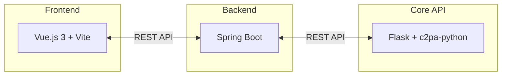
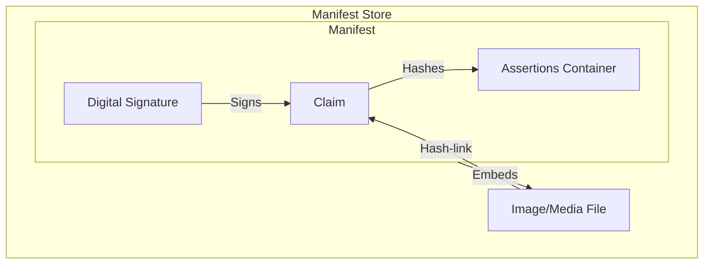

# C2PA 署名・検証デモアプリ

このプロジェクトは、画像のコンテンツ認証（C2PA: Coalition for Content Provenance and Authenticity）を体験するためのデモアプリケーションです。
画像の署名（Manifest の付与）と、署名された画像の検証を行うことができます。

---

## 🚀 クイックスタート

本アプリは「Frontend」「Backend」「Core API」の3層構造で構成されています。

### 1. プロジェクト構成



- **Frontend (`frontend`)**: Vue.js 3 を使用した UI。画像のアップロード、署名パラメータ指定、検証結果表示を行います。
- **Backend (`backend`)**: Spring Boot を使用した API ゲートウェイ。フロントエンドと Core API の仲介を行います。
- **Core API (`core-api`)**: Flask を使用した C2PA 処理基盤。`c2pa-python` SDK を使用して署名と検証の核となる処理を行います。

### 2. 起動方法

各ディレクトリで以下の手順を実行してください。

#### ① Core API (Python)
Python 3.9 以上が必要です。
```bash
cd core-api
python -m venv .venv
# Windows:
.venv\Scripts\activate
# Linux/macOS:
source .venv/bin/activate

pip install -r requirements.txt
python app.py
```
`http://localhost:5000` で起動します。

#### ② Backend (Java)
JDK 17 以上が必要です。
```bash
cd backend
./gradlew bootRun
```
`http://localhost:8080` で起動します。

#### ③ Frontend (Node.js)
Node.js 18 以上、および pnpm が必要です。
```bash
cd frontend
pnpm install
pnpm dev
```
`http://localhost:5173` で起動します。ブラウザでこの URL にアクセスしてください。

---

## 📘 C2PA テクニカルガイド

C2PA (Coalition for Content Provenance and Authenticity) は、デジタルコンテンツの由来（Provenance）を証明するためのオープンな標準規格です。

- **公式サイト**: [c2pa.org](https://c2pa.org/)
- **仕様書**: [C2PA Specifications](https://c2pa.org/specifications/)
- **詳細技術資料**: [C2PA 仕様詳説 (日本語)](./C2PA_SPEC.md)
- **Python SDK**: [c2pa-python (GitHub)](https://github.com/contentauth/c2pa-python)

### 1. マニフェストの構造

C2PA データ（マニフェスト）は、**JUMBF (ISO/IEC 19566-5)** というコンテナ形式でバイナリデータとしてメディアファイルに埋め込まれます。

#### 内部構造の図解


#### 各要素の役割
| 要素 | 役割 |
| :--- | :--- |
| **Claim (クレーム)** | マニフェストの「目次」。各アサーションのハッシュ値を保持し、改ざんを検知します。 |
| **Assertions (アサーション)** | コンテンツに関する具体的な表明（編集履歴、作成者、AI制限など）の集合。 |
| **Signature (署名)** | **Claim に対して**デジタル署名を行い、コンテンツ全体の正当性を保証します。 |
| **Manifest Store** | 過去の署名履歴も含めた、ファイル内の C2PA データ全体の格納場所。 |

### 2. Assertions (アサーション) の詳細

アサーションは、コンテンツの属性を記述する最小単位のデータブロックです。

- **c2pa.actions (編集履歴)**: 「作成」「リサイズ」などの操作ログ。オリジナルの状態からの変遷を追跡可能にします。
- **c2pa.ingredients (素材)**: 編集に使用された元の画像や素材への参照。合成画像の由来を特定できます。
- **cawg.training-mining (AI 学習制限)**: AI モデルの訓練やデータマイニングへの利用制限を定義します。
- **c2pa.metadata (メタデータ)**: 作成者名や著作権情報などの標準的なメタデータ。

> [!TIP]
> **機密性 (Redaction)**: プライバシー保護のため、特定のアサーションをハッシュの整合性を保ったまま「隠蔽」することも可能です。

### 3. Signature (署名) と信頼性

署名は、マニフェストが信頼できる機関によって作成されたことを保証します。

- **暗号アルゴリズム**: 本アプリでは **ES256 (ECDSA P-256/SHA-256)** を使用。高いセキュリティと軽量なデータサイズが特徴です。
- **証明書チェーン**: 認証局 (CA) によって発行された証明書を含み、署名者の身元を保証します。
- **タイムスタンプ (RFC 3161)**: 外部の TSA (Time Stamping Authority) を使用。証明書の有効期限が切れた後も「署名時点での有効性」を証明する（長期検証可能性）ために不可欠です。

### 4. JUMBF による埋め込み

C2PA は、既存の画像フォーマットの仕様を壊さないように JUMBF 形式でデータを格納します。

- **JPEG**: `APP11` マーカーセグメント
- **PNG**: `caBX` チャンク
- **WebP**: `JUMB` チャンク
- **MP4/MOV**: `moov/udta` ボックス

---

## 🛠️ 実装の詳細（デモ環境）

本デモアプリでは、テスト目的で以下の技術仕様を使用しています。

### 1. 署名設定
- **デジタル証明書**: `core-api/cert` 内のテスト用証明書を使用。
  - `es256_private.key` (秘密鍵) / `es256_certs.pem` (公開鍵証明書)
- **タイムスタンプ**: DigiCert TSA (`http://timestamp.digicert.com`) を利用。

### 2. AI 学習制限の対応
以下の3つのステータス付与に対応しています。
- `allowed`: 利用を許可
- `notAllowed`: 利用を禁止
- `constrained`: 特定の条件下で許可（詳細情報の付記が可能）

---

## ⚖️ ライセンス
このデモアプリは学習および評価目的で提供されています。
実際の運用環境で使用する場合は、適切な証明書管理やセキュリティ対策を行ってください。
